# Root Locus and Time Response Analysis using MATLAB

This repository contains MATLAB code for analyzing the **Root Locus** and **Time Response** of various control system transfer functions.
## 📌 Objective

To study the root locus method and analyze the time response of systems using MATLAB, and observe how adding poles and zeros affects system behavior.

---

## 🔧 How to Use

1. Open MATLAB.
2. Place `lab4_root_locus_analysis.m` in your working directory.
3. Run the script.
4. Root locus and step response plots for three systems will be generated for multiple values of gain \(k\).

---

## 📁 Transfer Functions Covered

### 1. **TF1:** No pole at origin

\[ G(s)H(s) = {k}{(s+4)(s+20)} \]

- Root locus and step response for different values of k (e.g., 1, 10, 100).
- System is always stable.

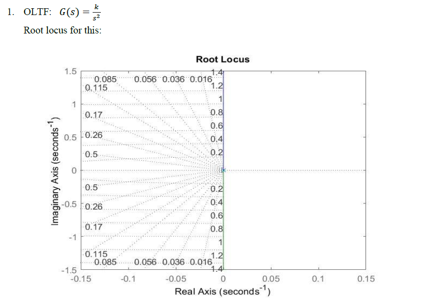

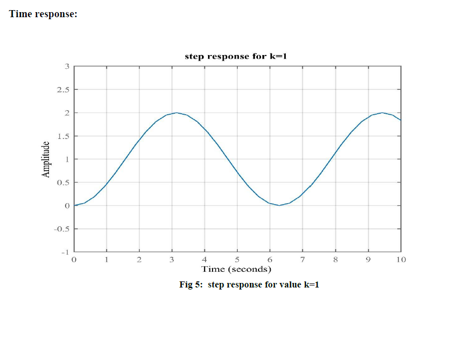

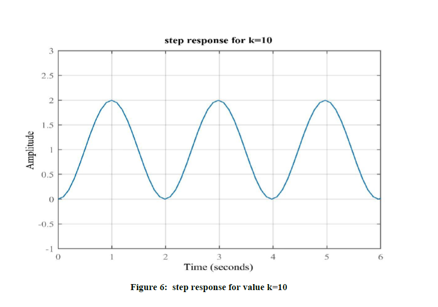

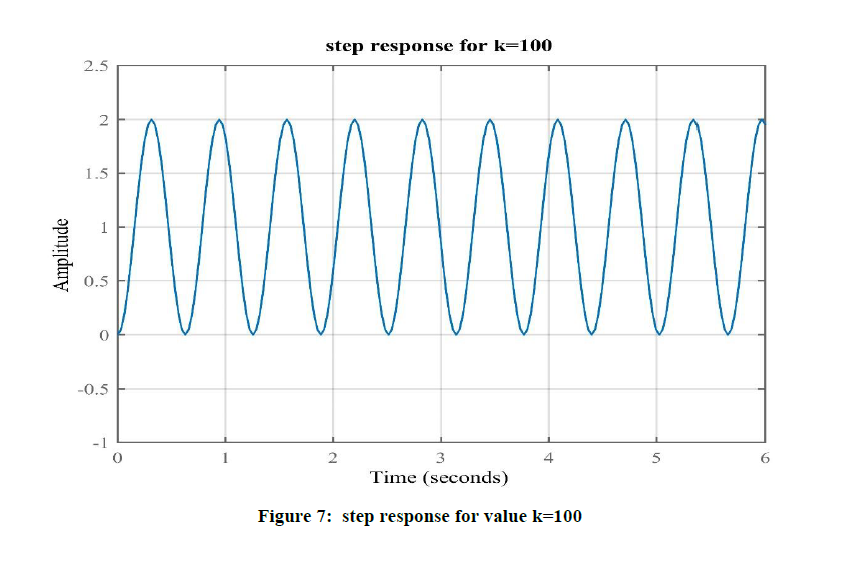

---

### 2. **TF2:** Pole added at origin

\[ G(s)H(s) = {k}{s(s+4)(s+20)} \]

- Added integrator (type 1 system).
- Stability depends on range of \(k\).

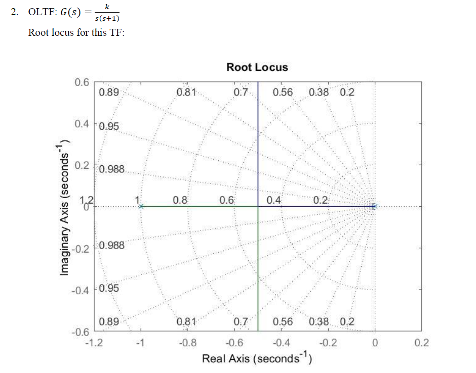

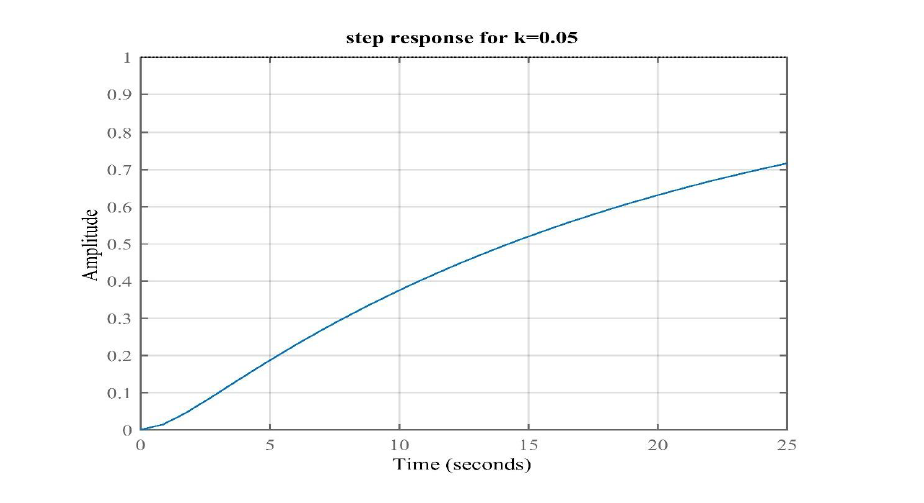

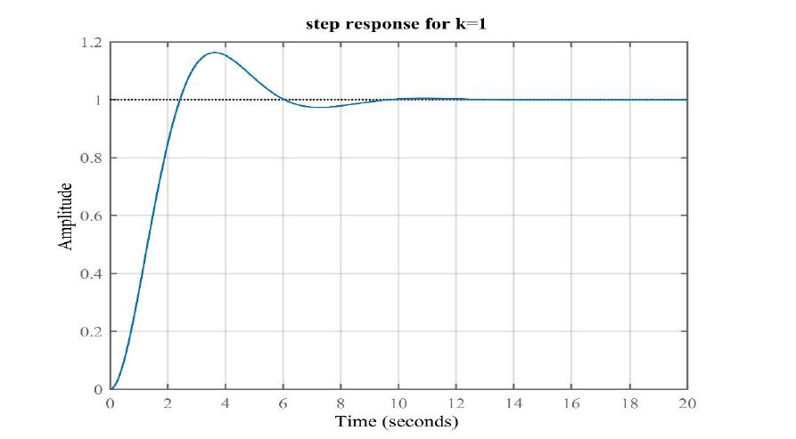

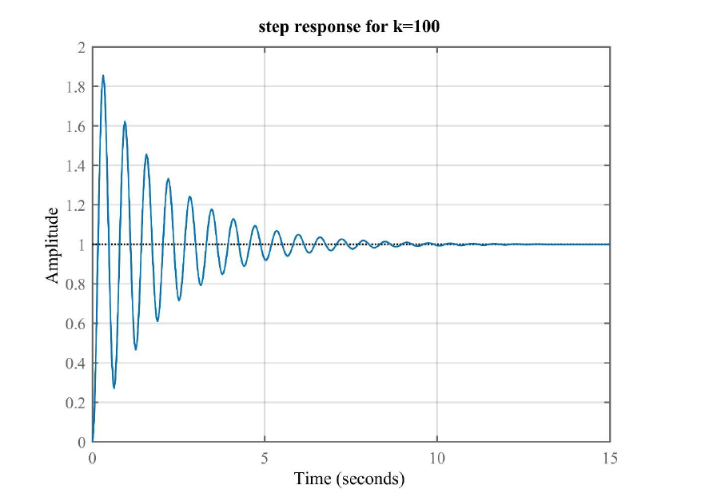

---

### 3. **TF3:** Zero added at -10

\[ G(s)H(s) = {k(s+10)}{(s+4)(s+20)} \]

- Improves damping and response speed.
- System becomes more stable.

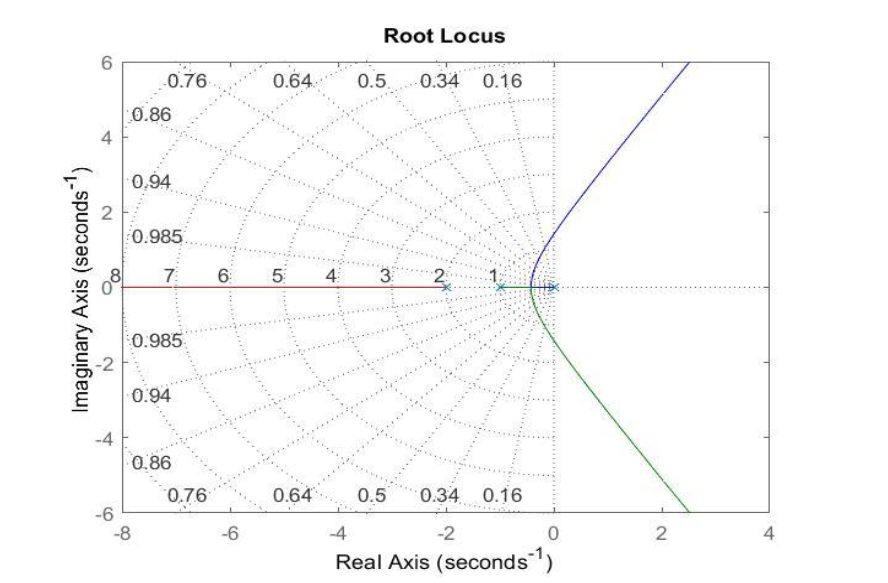

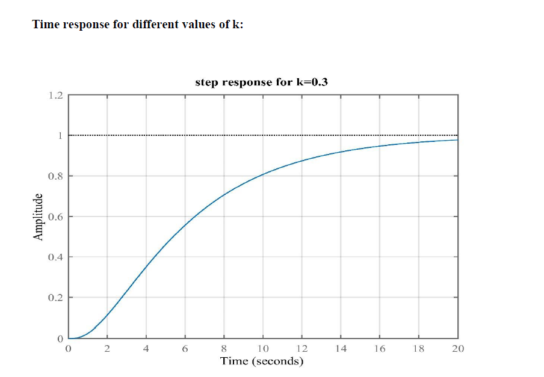

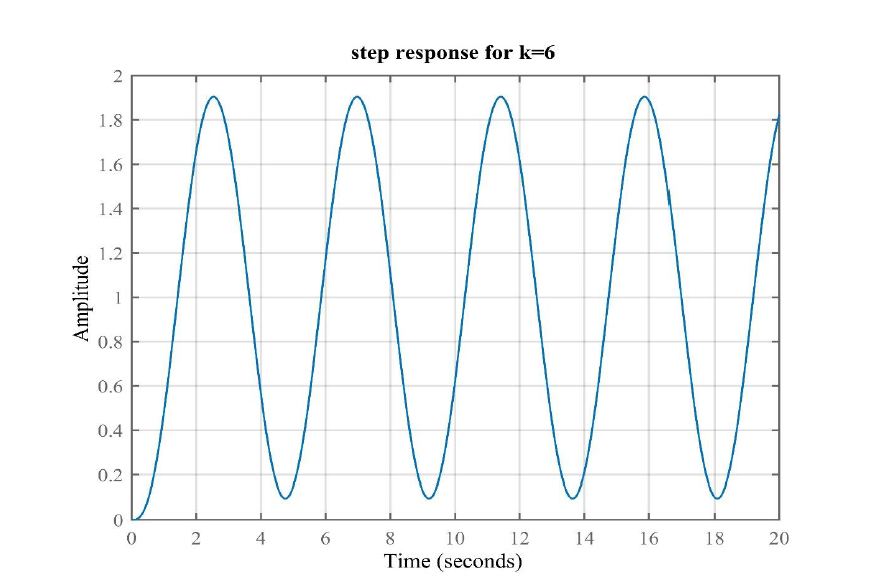

---

## 🧠 Observations Summary

| S.No | Transfer Function            | Added Element  | Effect                            |
| ---- | ---------------------------- | -------------- | --------------------------------- |
| 1    | \( {k}{(s+4)(s+20)} \)       | None           | Always stable                     |
| 2    | \( {k}{s(s+4)(s+20)} \)      | Pole at origin | Reduced stability for large \(k\) |
| 3    | \( {k(s+10)}{(s+4)(s+20)} \) | Zero at -10    | Better damping, faster response   |

---

## 📘 Author

Prepared as part of the **Control Systems Lab (EC5)** at **PDPM IIITDM Jabalpur** by @ex2uply.

---
